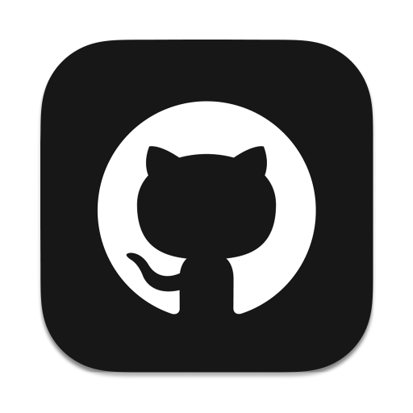

# I'm [Rohit Kumar]

Passionate full-stack developer with 4 years of experience in coding, specializing in web development. Enthusiastic about 3D modeling and robotics, having actively contributed to robotics projects. Explore my GitHub for a showcase of my diverse skills and projects, reflecting my early and continuous journey in coding.

Versatile professional with extensive experience in developing solutions across web, mobile, desktop, and embedded systems. Demonstrated proficiency in mastering emerging technologies and delivering advanced solutions that contribute to innovation in the dynamic tech landscape.

- 👨‍🎓 &nbsp;Pursuing my [B.Tech in CSE](https://www.srmist.edu.in).
- 📫 &nbsp;You can contact me [here](mailto:rohitkumar620200@gmail.com).

#

📊 &nbsp;Github Metrics

 

🛠️ &nbsp;Tools & Frameworks

 

> These are some of the tools and frameworks that I have worked with. My expertise includes working on web, mobile, desktop, and embedded systems. I have utilized a wide range of technologies, including Python, Rust, C, C++, Java, JavaScript, HTML, CSS, React, React Native, Electron, Node.js, GCP, MongoDB, MySQL, Flutter, Shell Scripting, Git, Docker, UE5, AWS, Unity, Fusion 360, Blender, EAGLE, easyEDA, Arduino, Raspberry Pi, ESP32, ESP8266, STM32, among others.

🔥 &nbsp;Github Streak

 

ℹ️ &nbsp;More Info

 

> Note: Passionate full-stack developer with 4 years of experience in coding, specializing in web development. Enthusiastic about 3D modeling and robotics, having actively contributed to robotics projects. Explore my GitHub for a showcase of my diverse skills and projects, reflecting my early and continuous journey in coding.

